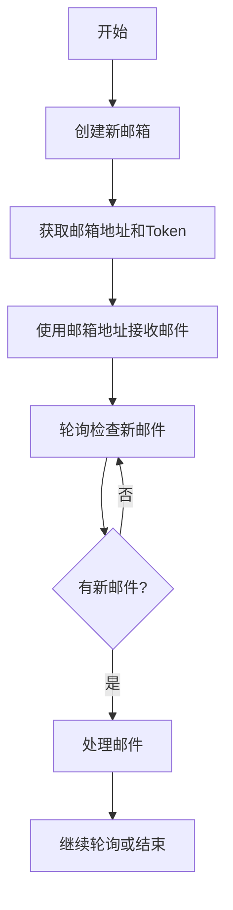

# Temp-Mail.io API 逆向工程文档

> 📅 **创建日期**: 2026-05-20  
> 📊 **版本**: 1.0.0  
> ✅ **状态**: 完成  
> 🧪 **测试状态**: 待测试

---

## 📋 目录

- [基础信息](#-基础信息)
- [认证机制](#-认证机制)
- [API端点](#-api端点)
- [使用流程](#-使用流程)
- [Python客户端实现](#-python客户端实现)
- [技术特性](#-技术特性)
- [限制和约束](#-限制和约束)
- [错误处理](#-错误处理)
- [最佳实践](#-最佳实践)
- [注意事项](#-注意事项)
- [更新日志](#-更新日志)

---

## 📌 基础信息

- **网站**: https://temp-mail.io/
- **API 基础URL**: `https://api.internal.temp-mail.io/api/`
- **API类型**: REST API
- **请求方式**: GET, POST
- **响应格式**: JSON
- **认证方式**: 自定义请求头（Application-Name, Application-Version, x-cors-header）

### 快速参考

| 项目 | 值 |
|------|-----|
| 推荐轮询间隔 | 5-10秒 |
| 会话时长 | 基于token |
| 邮箱保留期 | 未知 |
| 速率限制 | 未知 |

---

## 🔐 认证机制

### 认证类型

Temp-Mail.io使用自定义请求头进行认证，不需要传统的Token或Cookie认证。

### 必需的请求头

所有API请求都需要包含以下请求头：

```http
Application-Name: web
Application-Version: 4.0.0
x-cors-header: iaWg3pchvFx48fY
Content-Type: application/json
```

### 认证流程

1. 无需预先获取认证凭证
2. 直接在请求头中包含必需的自定义头部
3. 创建邮箱时会返回token用于后续操作

---

## 🔌 API端点

### 1. 创建新邮箱

**端点**: `/api/v3/email/new`

**方法**: POST

**描述**: 创建一个新的临时邮箱地址

**请求头**:
```http
Application-Name: web
Application-Version: 4.0.0
x-cors-header: iaWg3pchvFx48fY
Content-Type: application/json
User-Agent: Mozilla/5.0 (Windows NT 10.0; Win64; x64) AppleWebKit/537.36
```

**请求体**:
```json
{
  "min_name_length": 10,
  "max_name_length": 10
}
```

**请求参数**:

| 参数名 | 类型 | 必需 | 描述 |
|--------|------|------|------|
| min_name_length | integer | 是 | 邮箱用户名最小长度 |
| max_name_length | integer | 是 | 邮箱用户名最大长度 |

**响应示例**:
```json
{
  "email": "v1ehqgbcgc@gmeenramy.com",
  "token": "ijadPWbf7Y9w2WrFiuuE"
}
```

**响应字段说明**:

| 字段名 | 类型 | 描述 |
|--------|------|------|
| email | string | 生成的临时邮箱地址 |
| token | string | 用于后续操作的认证令牌 |

**cURL示例**:
```bash
curl -X POST 'https://api.internal.temp-mail.io/api/v3/email/new' \
  -H 'Application-Name: web' \
  -H 'Application-Version: 4.0.0' \
  -H 'x-cors-header: iaWg3pchvFx48fY' \
  -H 'Content-Type: application/json' \
  -d '{"min_name_length":10,"max_name_length":10}'
```

---

### 2. 获取邮件列表

**端点**: `/api/v3/email/{email}/messages`

**方法**: GET

**描述**: 获取指定邮箱的所有邮件列表

**请求头**:
```http
Application-Name: web
Application-Version: 4.0.0
x-cors-header: iaWg3pchvFx48fY
Content-Type: application/json
User-Agent: Mozilla/5.0 (Windows NT 10.0; Win64; x64) AppleWebKit/537.36
```

**URL参数**:

| 参数名 | 类型 | 必需 | 描述 |
|--------|------|------|------|
| email | string | 是 | 完整的邮箱地址 |

**响应示例（空邮箱）**:
```json
[]
```

**响应示例（有邮件）**:
```json
[
  {
    "id": "message_id",
    "from": "sender@example.com",
    "subject": "Test Email",
    "date": "2026-05-20T10:30:00Z",
    "body_text": "Email content",
    "body_html": "<p>Email content</p>"
  }
]
```

**响应字段说明**:

| 字段名 | 类型 | 描述 |
|--------|------|------|
| id | string | 邮件唯一标识符 |
| from | string | 发件人邮箱地址 |
| subject | string | 邮件主题 |
| date | string | 邮件接收时间（ISO 8601格式） |
| body_text | string | 邮件纯文本内容 |
| body_html | string | 邮件HTML内容 |

**cURL示例**:
```bash
curl -X GET 'https://api.internal.temp-mail.io/api/v3/email/v1ehqgbcgc@gmeenramy.com/messages' \
  -H 'Application-Name: web' \
  -H 'Application-Version: 4.0.0' \
  -H 'x-cors-header: iaWg3pchvFx48fY' \
  -H 'Content-Type: application/json'
```

---

### 3. 获取可用域名列表

**端点**: `/api/v4/domains`

**方法**: GET

**描述**: 获取所有可用的邮箱域名列表

**请求头**:
```http
Application-Name: web
Application-Version: 4.0.0
x-cors-header: iaWg3pchvFx48fY
Content-Type: application/json
User-Agent: Mozilla/5.0 (Windows NT 10.0; Win64; x64) AppleWebKit/537.36
```

**响应示例**:
```json
{
  "domains": [
    {
      "name": "bltiwd.com",
      "type": "public",
      "forward_available": true,
      "forward_max_seconds": 7776000
    },
    {
      "name": "wnbaldwy.com",
      "type": "public",
      "forward_available": true,
      "forward_max_seconds": 7772400
    },
    {
      "name": "bwmyga.com",
      "type": "public",
      "forward_available": true,
      "forward_max_seconds": 7776000
    },
    {
      "name": "ozsaip.com",
      "type": "public",
      "forward_available": true,
      "forward_max_seconds": 7776000
    },
    {
      "name": "yzcalo.com",
      "type": "public",
      "forward_available": true,
      "forward_max_seconds": 7776000
    },
    {
      "name": "lnovic.com",
      "type": "public",
      "forward_available": true,
      "forward_max_seconds": 7776000
    },
    {
      "name": "ruutukf.com",
      "type": "public",
      "forward_available": true,
      "forward_max_seconds": 7776000
    },
    {
      "name": "gmeenramy.com",
      "type": "public",
      "forward_available": true,
      "forward_max_seconds": 7776000
    }
  ]
}
```

**响应字段说明**:

| 字段名 | 类型 | 描述 |
|--------|------|------|
| domains | array | 域名对象数组 |
| name | string | 域名 |
| type | string | 域名类型（public/premium） |
| forward_available | boolean | 是否支持邮件转发 |
| forward_max_seconds | integer | 最大转发时长（秒） |

**cURL示例**:
```bash
curl -X GET 'https://api.internal.temp-mail.io/api/v4/domains' \
  -H 'Application-Name: web' \
  -H 'Application-Version: 4.0.0' \
  -H 'x-cors-header: iaWg3pchvFx48fY' \
  -H 'Content-Type: application/json'
```

---

## 🔄 使用流程

### 基本工作流程



### 详细步骤

1. **创建邮箱**
   ```python
   response = requests.post(
       'https://api.internal.temp-mail.io/api/v3/email/new',
       headers={
           'Application-Name': 'web',
           'Application-Version': '4.0.0',
           'x-cors-header': 'iaWg3pchvFx48fY',
           'Content-Type': 'application/json'
       },
       json={
           'min_name_length': 10,
           'max_name_length': 10
       }
   )
   data = response.json()
   email = data['email']
   token = data['token']
   ```

2. **获取域名列表（可选）**
   ```python
   response = requests.get(
       'https://api.internal.temp-mail.io/api/v4/domains',
       headers={
           'Application-Name': 'web',
           'Application-Version': '4.0.0',
           'x-cors-header': 'iaWg3pchvFx48fY',
           'Content-Type': 'application/json'
       }
   )
   domains = response.json()['domains']
   ```

3. **轮询检查邮件**
   ```python
   import time
   
   while True:
       response = requests.get(
           f'https://api.internal.temp-mail.io/api/v3/email/{email}/messages',
           headers={
               'Application-Name': 'web',
               'Application-Version': '4.0.0',
               'x-cors-header': 'iaWg3pchvFx48fY',
               'Content-Type': 'application/json'
           }
       )
       messages = response.json()
       
       if messages:
           for message in messages:
               print(f"From: {message['from']}")
               print(f"Subject: {message['subject']}")
               print(f"Content: {message['body_text']}")
           break
       
       time.sleep(5)  # 等待5秒后再次检查
   ```

---

## 💻 Python客户端实现

详见 `tempmailio_client.py` 文件

---

## 🎯 技术特性

### 优点

1. **简单易用**: API设计简洁，易于集成
2. **无需注册**: 不需要账号即可使用
3. **多域名支持**: 提供多个公共域名选择
4. **邮件转发**: 支持邮件转发功能
5. **实时更新**: 通过轮询可以实时获取新邮件

### 技术亮点

1. **RESTful设计**: 遵循REST API设计规范
2. **JSON格式**: 使用标准JSON格式交换数据
3. **自定义认证**: 使用自定义请求头进行认证
4. **版本控制**: API路径包含版本号（v3, v4）

---

## ⚠️ 限制和约束

### 已知限制

1. **邮箱生命周期**: 邮箱的具体保留时间未明确说明
2. **速率限制**: 未明确说明API调用频率限制
3. **邮件大小限制**: 未明确说明单封邮件大小限制
4. **附件支持**: 未确认是否支持附件
5. **邮件保留期**: 未明确说明邮件在邮箱中的保留时间

### 使用约束

1. 需要包含特定的请求头才能正常访问API
2. 邮箱用户名长度受min_name_length和max_name_length参数限制
3. 需要通过轮询方式检查新邮件（无WebSocket或推送机制）

---

## 🚨 错误处理

### HTTP状态码

| 状态码 | 说明 | 处理方式 |
|--------|------|----------|
| 200 | 请求成功 | 正常处理响应数据 |
| 400 | 请求参数错误 | 检查请求参数格式 |
| 401 | 认证失败 | 检查请求头是否正确 |
| 404 | 资源不存在 | 检查邮箱地址是否正确 |
| 429 | 请求过于频繁 | 增加轮询间隔 |
| 500 | 服务器错误 | 稍后重试 |

### 错误处理示例

```python
import requests
from requests.exceptions import RequestException

def safe_api_call(url, **kwargs):
    try:
        response = requests.get(url, **kwargs)
        response.raise_for_status()
        return response.json()
    except requests.exceptions.HTTPError as e:
        if e.response.status_code == 429:
            print("请求过于频繁，请稍后重试")
            time.sleep(10)
        elif e.response.status_code == 404:
            print("邮箱不存在")
        else:
            print(f"HTTP错误: {e}")
    except RequestException as e:
        print(f"请求失败: {e}")
    return None
```

---

## 💡 最佳实践

### 1. 轮询策略

```python
# 推荐使用指数退避策略
import time

def poll_messages(email, max_attempts=10):
    interval = 5  # 初始间隔5秒
    max_interval = 60  # 最大间隔60秒
    
    for attempt in range(max_attempts):
        messages = get_messages(email)
        if messages:
            return messages
        
        time.sleep(interval)
        interval = min(interval * 1.5, max_interval)  # 指数增长
    
    return []
```

### 2. 请求头管理

```python
# 统一管理请求头
DEFAULT_HEADERS = {
    'Application-Name': 'web',
    'Application-Version': '4.0.0',
    'x-cors-header': 'iaWg3pchvFx48fY',
    'Content-Type': 'application/json',
    'User-Agent': 'Mozilla/5.0 (Windows NT 10.0; Win64; x64) AppleWebKit/537.36'
}

def make_request(url, method='GET', **kwargs):
    kwargs.setdefault('headers', {}).update(DEFAULT_HEADERS)
    return requests.request(method, url, **kwargs)
```

### 3. 错误重试机制

```python
from tenacity import retry, stop_after_attempt, wait_exponential

@retry(
    stop=stop_after_attempt(3),
    wait=wait_exponential(multiplier=1, min=4, max=10)
)
def create_mailbox_with_retry():
    return create_mailbox()
```

### 4. 邮箱地址验证

```python
import re

def validate_email(email):
    pattern = r'^[a-zA-Z0-9]+@[a-zA-Z0-9]+\.[a-zA-Z]{2,}$'
    return re.match(pattern, email) is not None
```

---

## 📝 注意事项

### 安全性

1. **不要用于敏感信息**: 临时邮箱不应用于接收敏感或重要信息
2. **公开性质**: 所有邮件都可能被他人访问
3. **无加密保证**: 邮件内容可能未加密传输

### 稳定性

1. **服务可用性**: 服务可能随时变更或停止
2. **API变更**: API端点和参数可能在未通知的情况下变更
3. **数据持久性**: 邮件和邮箱可能随时被删除

### 合规性

1. **使用条款**: 使用前应阅读并遵守服务条款
2. **滥用防范**: 避免用于垃圾邮件或恶意用途
3. **频率限制**: 遵守合理的API调用频率

---

## 📊 更新日志

### v1.0.0 (2026-05-20)

- ✅ 完成API逆向工程
- ✅ 识别3个主要API端点
- ✅ 创建完整API文档
- ✅ 记录请求头要求
- ✅ 记录域名列表功能
- 📝 待进行真实邮件测试

---

## 🔗 相关资源

- **官方网站**: https://temp-mail.io/
- **项目仓库**: D:\Xcode\20260519_IBM_CrazyMail\04_20260520_temp-mail.io_REST-API\
- **Python客户端**: tempmailio_client.py
- **测试脚本**: test_tempmailio.py

---

## 📞 技术支持

如有问题或建议，请参考项目文档或提交Issue。

---

**文档版本**: 1.0.0  
**最后更新**: 2026-05-20  
**维护者**: Bob (AI Assistant)